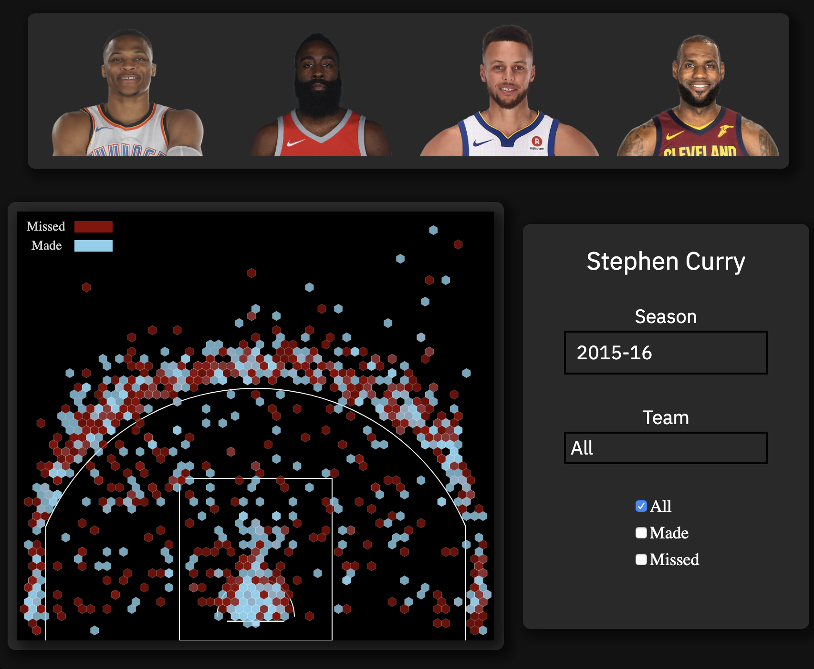

# NBA-Shot-Crunch

Creating a shot-chart of individual top NBA-level players. Users are able to filter the data for each player by season, team, and whether the shot was made or missed.

[Live Link](https://nba-shot-crunch.herokuapp.com/)

## Technologies

* Javascript
* CSS and HTML5 Canvas
* D3

## DataSet

Data was parsed from the [NBA Stats API](https://stats.nba.com/) along with [toddwschneider](https://github.com/toddwschneider)'s [nba-shots-db](https://github.com/toddwschneider/nba-shots-db)

## Features



### Basketball Court 

D3.js was used to plot the basketball court chart reflecting the dimensions of an [NBA Court](https://en.wikipedia.org/wiki/Basketball_court).

```javascript
    this.chart.append("line")
      .attr("x1", 30)
      .attr("y1", 470)
      .attr("x2", 30)
      .attr("y2", cornerThreePoint)
      .attr("stroke", "white");

    this.chart.append("line")
      .attr("x1", 470)
      .attr("y1", 470)
      .attr("x2", 470)
      .attr("y2", cornerThreePoint)
      .attr("stroke", "white");

    const threePointArc = d3.arc()
      .innerRadius(239)
      .outerRadius(240)
      .startAngle(-90 * (pi / 180))
      .endAngle(90 * (pi / 180))
```

### Shots

Hexagonal binning(d3-hexbin) was used to reflect the shots taken with missed shots and made shots representing blue. Shot coordinates on a basketball court often overlap each other so the hexgonal binning is a great way to display the density of a player's shots taken on the court; more saturated colors means more number of shots was taken at that area)

```javascript
 if(shotOutcome === "Made Shot") {
        this.svg.append("g")
          .selectAll(".hexagon")
          .data(hexbin([playerPos]))
          .enter().append("path")
          .attr("d", function (d) {
            return "M" + d.x + "," + d.y + hexbin.hexagon();
          })
          .attr('class', 'made-shot')
          .attr("stroke", "white")
          .attr('transform', 'translate(250, 52.5)')
          .attr("fill", "skyblue")
          .attr("fill-opacity", CONSTANTS.SHOT_OPACITY)
          .attr("stroke-width", "0.1px")
          .attr("transform", "rotate(180 125,208.5)")
```

### Shot Filters

Among the players that are listed, filters were created to parse a player's shots according to the user's indicated shots of shot made/missed, season, or team against.

```javascript
 parseCareerShots(firstName = 'Stephen', lastName = "Curry") {
    for (let i = 2015; i < 2018; i++) {
      let season = `${i}-${(i+1)-2000}`
      d3.csv(`./assets/${firstName}_${lastName}_${season}.csv`).then(shots => {
        shots.forEach( shot => {
          let shotOutcome = shot.event_type;
          let shotX = shot.loc_x;
          let shotY = shot.loc_y;
          this.getMadeShots(shotX, shotY, shotOutcome);
        })
      })
    }
  }
```


## Future Implementations

* Show a users Shot chart percentage at a given spot as well as a total percentage according to the filters.
